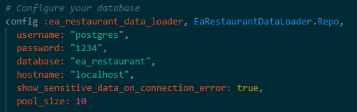
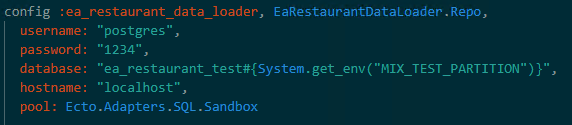

# ea_restaurant_data_loader

ea_restaurant_data_loader is a microservice as part of [ea_restaurant](https://github.com/eapg/EA_RESTAURANT) project to load data into database from an excel file using the functional programming language elixir. This service will load data into database to feed products, inventory, inventory_ingredients, chefs tablets, etc. Also it is good to mention that the service will load massive data into the database with the particularity that it doesn't interrupt the flow of the project, and it will not sacrifice performs of the main application.  

The main objective of this project is the introduction of functional programming with elixir and its web framework phoenix. This project will impact the whole application since it works in asynchronous way it didn't depend of the flow of the whole app. Also This project can improve the whole application as the functional programming can offer several benefits such as improved readability and maintainability, enhance testability and debugging, and increase performance and scalability.

## Ea_Restaurant_Data Loader Setup:

* Windows:

    In order to setup and compile or run test in ea_restaurant_data_loader project you need to follow the following steps:

    * You need to install the [Erlang/OTP](https://www.erlang.org/downloads) and the [Elixir](https://elixir-lang.org/install.html#windows) programming language

    The secret files are use to store all the information that you may not share in version control or any place out of workplace.

    * In order to Set up secrets is necessary to create the following files inside `config` folder:
        * `dev.secret.exs`
        * `test.secret.exs`
        * `prod.secret.exs`

    The file example_secret.exs inside config folder have an example of what to store on thoses files.

    In order to use secrets inside secret file you can access them using the following code line:
        * `Application.get_env(:ea_restaurant_data_loader, :secret_key)` # Will return the secret key from .secret.exs file

    ### Dependencies

    * In order to get the neccesary dependencies for the project you have to run in project root location the command:
        * mix deps.get

    ### Migrations

    Before to be able to run migrations you need to create two postgresql databases, one for dev/prod and other for testing. After databases are created you need to config the enviroments to use those db.

    * Inside config folder config dev database in `dev.exs` file:

    

    * Inside config folder config test database in `test.exs` file:

    

    In order to run migrations in the specific enviroment it is neccessary to set the enviroment in the `mix.exs` file changing the line `start_permanent: Mix.env() == :prod` where you can choose the enviroment changing `:prod` by `:dev` or `:test` depending in which enviroment you want to run migrations.

    After choose the desire enviroment you can run the command : `mix ecto.migrate`

    ### Compile, testing or run server

    After dependencies are installed and migrations ran we are ready to compile the project, run tests or run the Phoenix server, running the following commands in project root location:

    * `mix compile` for compile the project
    * `mix test` for run all test
    * `mix phx.server` for run phoenix server